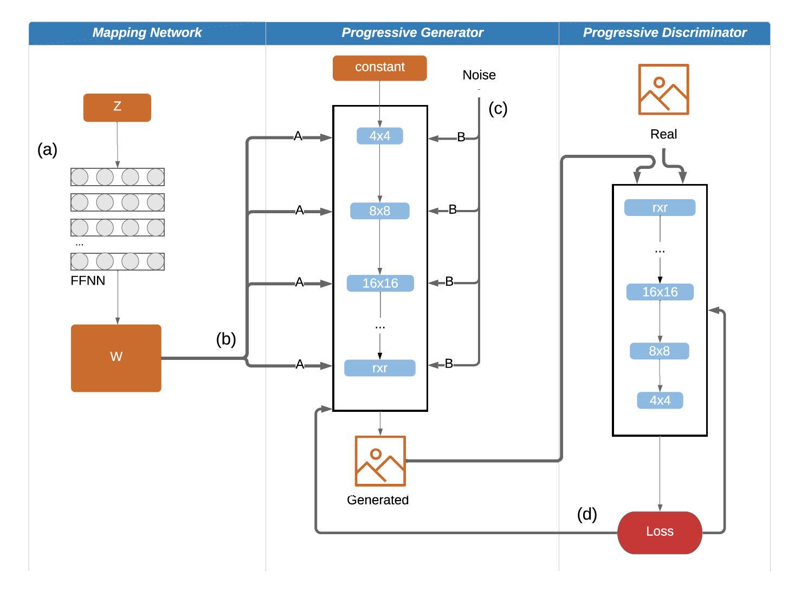
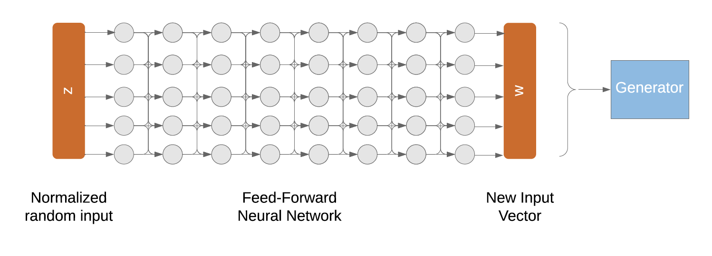
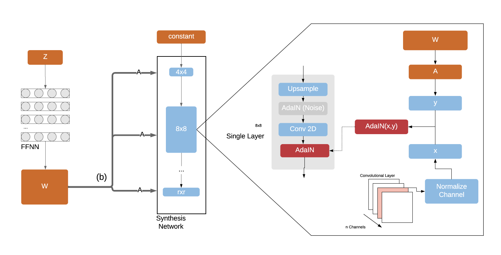
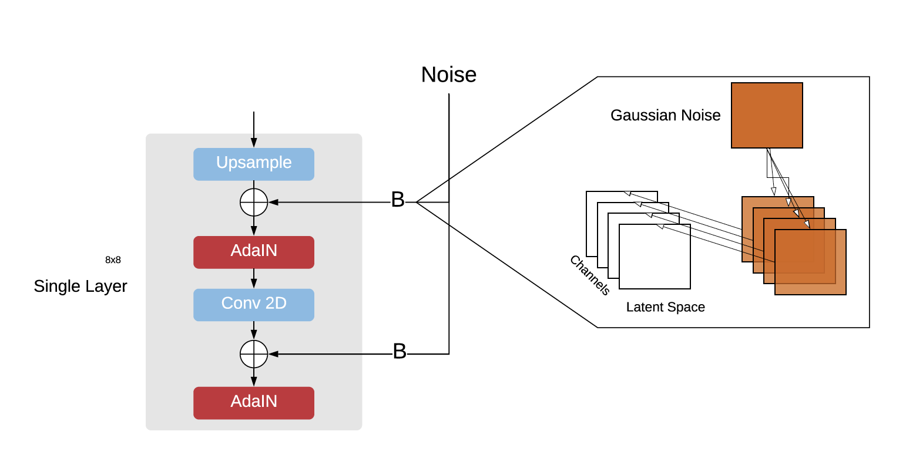
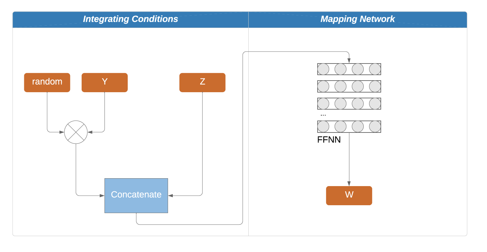

# Conditional Style-Based Logo Generation with Generative Adversarial Networks

Implementation of a conditional StyleGAN architecture based on the official source code [published by NVIDIA](https://github.com/NVlabs/stylegan)

**Results** *A preview of logos generated by the conditional StyleGAN synthesis network.*


> **Abstract:**
*Domains such as logo synthesis, in which the data has a high degree of multi-modality, still pose a challenge for generative adversarial networks (GANs). Recent research shows that progressive training (ProGAN) and mapping network extensions (StyleGAN) enable both increased training stability for higher dimensional problems and better feature separation within the embedded latent space. However, these architectures leave limited control over shaping the output of the network, which is an undesirable trait in the case of logo synthesis. This thesis explores a conditional extension to the StyleGAN architecture with the aim of firstly, improving on the low resolution results of previous research and, secondly, increasing the controllability of the output through the use of synthetic class-conditions. Furthermore, methods of extracting such class conditions are explored with a focus on the human interpretability, where the challenge lies in the fact that, by nature, visual logo characteristics are hard to define. The introduced conditional style-based generator architecture is trained on the extracted class-conditions in two experiments and studied relative to the performance of an unconditional model. Results show that, whilst the unconditional model more closely matches the training distribution, high quality conditions enabled the embedding of finer details onto the latent space, leading to more diverse output.*


## Architecture

The StyleGAN architecture aimed to improve on feature entanglement present in the [ProGAN](https://arxiv.org/abs/1710.10196) architecture through various extensions as marked by (a), (b) and (c) on the below figure:



##### Mapping Network (a)
As opposed to feeding a random vector straight into the generator, the input
is projected onto an intermediate latent space w by being fed through a mapping
network.


##### AdaIN (b)
In context of the mapping network, the intermediate vector
w is transformed into the scale and bias of the AdaIN equation. Noting that w reflects the style, AdaIN, through its normalization process, determines the importance of individual parameters in the convolutional layers. Thus, through
AdaIN, the feature map is translated into a visual representation.




##### Stochastic Variation (c)

The noise inputs take the form of two-dimensional matrices sampled from a
Gaussian distribution. These are then scaled to match the dimensions within
the layer and applied to each channel (Karras et al., 2018). This introduces
variation within that feature space.



### Introducing Conditions

In order to enable control the style of the generated output, conditions are introduced. There are two major differences between the conditional and un-
conditional StyleGAN architectures, namely the way the input to the generator
w is produced and in how the discriminator calculates its loss.

Firstly, noise is introduced to the one-hot encoded class conditions, which are then concatenated with the input space z before being fed into the mapping network.



Secondly, the WGAN-GP takes on a conditional format:


## Proposed Data: BoostedLLD
For this paper we removed all text-based images from the [LLD-logo dataset](https://data.vision.ee.ethz.ch/sagea/lld/#paper) and extended the remaining logos with image based logos and illustrations scraped off of Google images.


**Figure 2:** *As seen above, the extension also included vector illustrations that were not originally intended as logos, but carry visual characteristics of such.*


#### The data will be made available shortly.

## Training

#### Model Training Progress Video:

[](https://www.youtube.com/watch?v=GjcuMByKgKs)


 ## Code Base Structure

 | Path | Description
 | :--- | :----------
 | ConditionalStyleGAN | Main folder.
 | &boxv;&nbsp; dnnlib | Misc. utility functions and classes
 | &boxv;&nbsp; &boxv;&nbsp; submission | Helpers for managing the training loop
 | &boxv;&nbsp; &boxv;&nbsp; tflib | Helper for managing networks and optimization
 | &boxv;&nbsp; &boxvr;&nbsp; ```__init__.py``` | Misc. utility functions and classes
 | &boxv;&nbsp; &boxvr;&nbsp; ```util.py``` | Misc. utility functions and classes
 | &boxv;&nbsp; metrics | Network evaluation functions
 | &boxv;&nbsp; &boxvr;&nbsp; ```frechet_inception_distance.py``` | FID function
 | &boxv;&nbsp; &boxvr;&nbsp; ```metric_base.py``` | GAN metrics
 | &boxv;&nbsp; &boxvr;&nbsp; ```perceptual_path_length.py``` | Perceptual path length
 | &boxv;&nbsp; training | Data, networks and training
 | &boxv;&nbsp; &boxvr;&nbsp; ```dataset.py``` | Multi-resolution input data pipeline
 | &boxv;&nbsp; &boxvr;&nbsp; ```loss.py``` | Loss functions
 | &boxv;&nbsp; &boxvr;&nbsp; ```misc.py``` | Misc. utility functions
 | &boxv;&nbsp; &boxvr;&nbsp; ```networks_stylegan.py``` | Network architectures used in the StyleGAN paper
 | &boxv;&nbsp; &boxvr;&nbsp; ```training_loop.py``` | Main training script
 | &boxvr;&nbsp; ```config.py``` | Global configuration
 | &boxvr;&nbsp; ```dataset_tool.py``` | Tool for creating multi-resolution TFRecords datasets
 | &boxvr;&nbsp; ```generate_figures.py``` | Figures generation
 | &boxvr;&nbsp; ``pretrained_example.py`` | StyleGAN single example
 | &boxvr;&nbsp; ``run_metrics.py`` | Evaluation
 | &boxvr;&nbsp; ```train.py``` | Main entry point for training


## Data Preparation
The ```dataset_tool.py``` script is responsible for turning your data into Tensorflow record files. However, each image in the data set must have the <u>exact</u> same format in terms of size, extension, colour space and bit depth. Any irregular images will automatically be kicked from the data set.

We refer you to the [imagemagick](https://imagemagick.org/index.php) library for all transformation tools.

The script takes a pickled dictionary as input with the following format:

```
# Pickle path = '../data/mypickle.pickle'
mypickle = {"Filenames": list_of_file_paths, "Labels": class_condition_labels}
```

The script is run from the terminal and takes the paths to your images and the path of your TF-record directory as flags

```
python dataset_tool.py create_from_images dataset/logos ../data/my_images
```

## Training

### Step 1
These variables have to be adjusted according to your needs in multiple scripts before training:

#### Path to TF records (e.g. dataset/logos)
- ```train.py``` line 37:

> ``` desc += '-logos';     dataset = EasyDict(tfrecord_dir='logos', resolution=128);```

- ```./training/dataset.py``` line 49:

> ```self.tfrecord_dir       = 'dataset/logos'```

#### Number of class-conditions
<i>These lines refer to section at which you can also adjust hyperparameters.</i>
- ```./training/networks_stylegan.py``` line 388 & line 569:

> ``` label_size = 10```

### Step 2:
Set hyper-parameters for networks and other indications for the training loop

#### General
Starting at line 112 in ```training_loop.py```:
```
G_smoothing_kimg        = 10.0,     # Half-life of the running average of generator weights.
D_repeats               = 2,        # How many times the discriminator is trained per G iteration.
minibatch_repeats       = 1,        # Number of minibatches to run before adjusting training parameters.
reset_opt_for_new_lod   = True,     # Reset optimizer internal state (e.g. Adam moments) when new layers are introduced?
total_kimg              = 20000,    # Total length of the training, measured in thousands of real images.
mirror_augment          = True,     # Enable mirror augment?
drange_net              = [-1,1],   # Dynamic range used when feeding image data to the networks.
```
#### Mapping Network
Starting at line 384 in ```networks_stylegan.py```:
```
dlatent_size            = 128,          # Disentangled latent (W) dimensionality.
mapping_layers          = 8,            # Number of mapping layers.
mapping_fmaps           = 128,          # Number of activations in the mapping layers.
mapping_lrmul           = 0.01,         # Learning rate multiplier for the mapping layers.
mapping_nonlinearity    = 'lrelu',      # Activation function: 'relu', 'lrelu'.
use_wscale              = True,         # Enable equalized learning rate?
normalize_latents       = True,         # Normalize latent vectors (Z) before feeding them to the mapping layers?
```
#### Synthesis Network
Starting at line 384 in ```networks_stylegan.py```:
```
resolution          = 128,          # Output resolution.
fmap_base           = 8192,         # Overall multiplier for the number of feature maps.
fmap_decay          = 1.0,          # log2 feature map reduction when doubling the resolution.
fmap_max            = 128,          # Maximum number of feature maps in any layer.
use_styles          = True,         # Enable style inputs?
const_input_layer   = True,         # First layer is a learned constant?
use_noise           = True,         # Enable noise inputs?
randomize_noise     = True,         # True = randomize noise inputs every time (non-deterministic), False = read noise inputs from variables.
nonlinearity        = 'lrelu',      # Activation function: 'relu', 'lrelu'
use_wscale          = True,         # Enable equalized learning rate?
use_pixel_norm      = False,        # Enable pixelwise feature vector normalization?
use_instance_norm   = True,         # Enable instance normalization?
dtype               = 'float32',    # Data type to use for activations and outputs.
fused_scale         = 'auto',       # True = fused convolution + scaling, False = separate ops, 'auto' = decide automatically.
blur_filter         = [1,2,1],      # Low-pass filter to apply when resampling activations. None = no filtering.

```
#### Discriminator Network
Starting at line 384 in ```networks_stylegan.py```:

```
fmap_base           = 8192,         # Overall multiplier for the number of feature maps.
fmap_decay          = 1.0,          # log2 feature map reduction when doubling the resolution.
fmap_max            = 128,          # Maximum number of feature maps in any layer.
nonlinearity        = 'lrelu',      # Activation function: 'relu', 'lrelu',
use_wscale          = True,         # Enable equalized learning rate?
mbstd_group_size    = 4,            # Group size for the minibatch standard deviation layer, 0 = disable.
mbstd_num_features  = 1,            # Number of features for the minibatch standard deviation layer.
fused_scale         = 'auto',       # True = fused convolution + scaling, False = separate ops, 'auto' = decide automatically.
blur_filter         = [1,2,1],      # Low-pass filter to apply when resampling activations. None = no filtering.
```

### Step 3
Initialize training of architecture by running:

`` python train.py ``

## Evaluating the Network

In order to evaluate the network, select evaluation tasks in line 80 of
`` run_metrics.py`` and insert relevant network pickle path:

>```tasks += [EasyDict(run_func_name='run_metrics.run_pickle', network_pkl='./results/pickle.pkl', dataset_args=EasyDict(tfrecord_dir='logos', shuffle_mb=0), mirror_augment=True)]```
